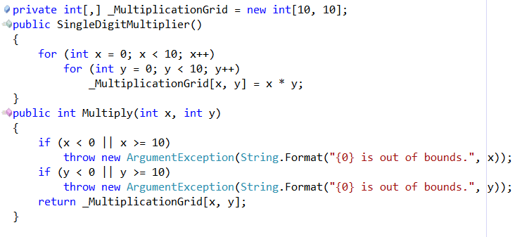
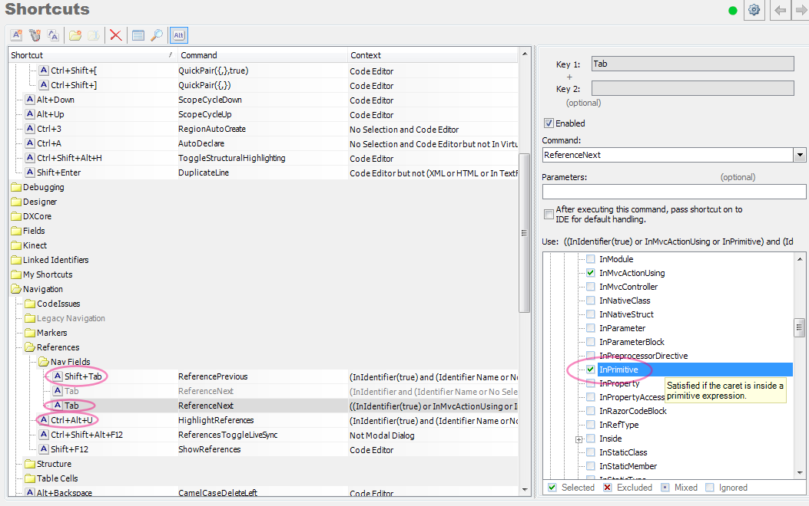

'Options Inverter' for CodeRush
===

This plugin extends the existing [Tab to Next Reference](http://community.devexpress.com/blogs/rorybecker/archive/2011/04/08/coderush-tip-tab-to-next-reference.aspx) feature that comes with CodeRush

The existing feature works in all sorts of contexts. From Identifiers, to Types and across multiple languages. 

This plugin adds the ability to Tab among references to primitives (string, int, bool etc) of the same value within a single file.

So you might tab between references to the number **10** or to the string "**This is a string**"

Usage
======
Place your caret within the primitive and hit **Tab**

Additional Configuration
======

The existing Tab to Next Reference feature is unaware of the new functionality and the default context of 3 related shortcuts will prevent this plugin from working unless altered.

You will need to add the **Editor\Code\InPrimitive** context to the **Shift+Tab**, **Tab**, and **Shift+Alt+U** 
These bindings can be found in the **Navigation\References\Nav Fields** folder of the [Shortcuts Options Page](http://community.devexpress.com/blogs/rorybecker/archive/2010/10/05/binding-keys-in-coderush.aspx)

